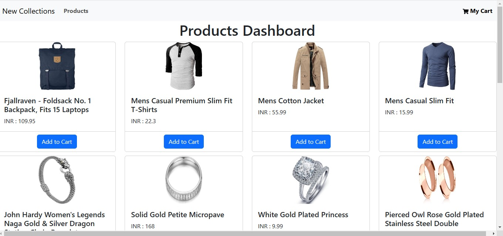
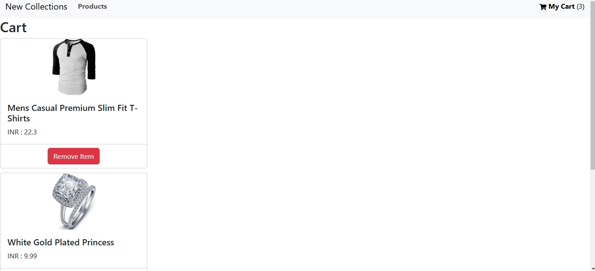

# workflow

# Create Store: 
Set up a central store using configureStore() from Redux Toolkit to manage application state.

# Create Slice:
Use createSlice() to define state and reducers (actions) for managing the cart, such as adding and removing items.

# Dispatch Actions: 
In components, dispatch actions to modify the state (e.g., adding products to the cart).

# Access State: 
Use useSelector to access the cart state in components for displaying cart contents.

# Images

